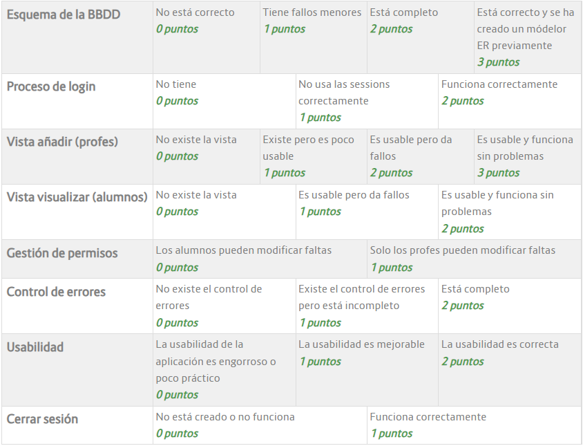

<h2>TODO: General</h2>

- Insercion faltas 🚧
  - Lista de alumnos x Dia ✅ ❓
  - Tipo de falta 🚧
    - Justificada 🛑
    - No justificada 🛑
- Visualizacion faltas ✅ ❓
  - Alumnos ✅ ❓
  - Profesor ✅ ❓

<h2>TODO: Concreto</h2>

- **[Prioridad: Alta]** Modelo ER **Diagrama**
  - Evitar que se puedan añadir faltas repetidas misma sesion dia
- **[Prioridad: Alta]** Readaptacion base de datos **SQL**
  - Añadir tipo de falta
  - Modificar faltas. Se ven las faltas en el insertado
- **[Prioridad: Media-Alta]** Insercion de faltas **PHP**
- **[Prioridad: Media]** Visualizacion de faltas **PHP**
  - Alumno
    - Añadir tipo de falta
    - Añadir motivo de falta
  - Profesor
    - Añadir tipo de falta
    - Añadir motivo de falta
- **[Prioridad: Media]** Actualizar falta **PHP**
  - Cambiar tipo
  - Justificar

<h2>DONE:</h2>

- login✅❓
- Cerrar sesion✅❓

